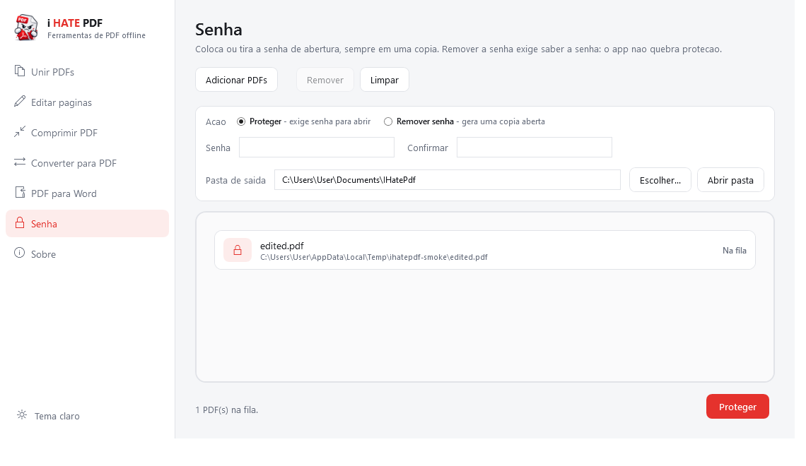
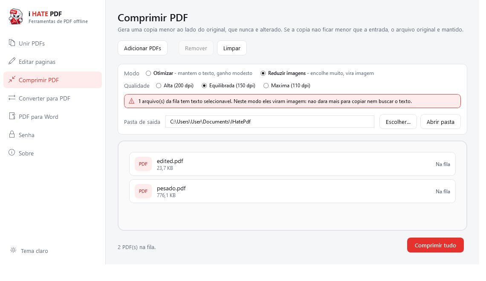

<div align="center">


### O PDF começou. Você termina.

Unir, reorganizar e converter PDFs no Windows — **sem upload, sem conta, sem marca d'água**.<br/>
Nenhum arquivo sai da sua máquina.

<br/>

[](https://github.com/XandeBritez/i-hate-pdf/releases/latest)
&nbsp;


</div>

---

## Por que existe

Todo site de PDF grátis cobra o mesmo pedágio: subir seu contrato para o servidor de um desconhecido, esperar a fila, aceitar a marca d'água e torcer para que o arquivo seja apagado depois.

**i HATE PDF** não tem servidor. É um `.exe`, você arrasta, ele resolve.

<div align="center">

</div>

---

## O que ele faz

<table>
<tr>
<td width="33%" valign="top">

### 🧩 Unir
Arraste vários PDFs. Cada um vira um **card com a capa visível** e um número que é literalmente a posição dele no documento final. Arrastou o card, mudou a ordem.

</td>
<td width="33%" valign="top">

### ✂️ Editar páginas
Abra um PDF e veja **cada página como miniatura**. Marque as que morrem, arraste as que ficam, **gire** as tortas, puxe páginas de outro arquivo. Cada card mostra a **posição nova** e a **original** (`era 3`). **Salvar seleção** grava só as páginas marcadas num arquivo à parte — é assim que se divide um PDF aqui. O original nunca é tocado.

</td>
<td width="33%" valign="top">

### 🔁 Converter
`TXT` e **imagens** (JPG, PNG, WEBP, BMP, GIF, TIFF) viram PDF direto — e as imagens podem virar **um arquivo cada ou um PDF único**, na ordem da fila.<br/>
`DOCX` e `XLSX` passam pelo **LibreOffice headless**.

</td>
</tr>
</table>

### 🔐 Senha

Coloca senha de abertura (AES-256) ou tira, sempre gerando uma cópia. **Remover exige saber a senha** — o app não quebra proteção, ele regrava sem criptografia para quem já tem acesso.

<div align="center">

</div>

### 🗜️ Comprimir

Dois modos, porque não existe um só que sirva para tudo:

- **Otimizar** reescreve o arquivo com os fluxos comprimidos. O texto continua selecionável; o ganho depende de quanto o gerador original desperdiçou.
- **Reduzir imagens** rasteriza cada página em JPEG (200 / 150 / 110 dpi). É o que realmente encolhe digitalizações — mas o documento **deixa de ter texto selecionável**, e o app avisa antes quantos arquivos da fila perderiam isso.

Medido num PDF de 8 páginas cheias de imagem:

| Modo | Antes | Depois | Ganho |
|---|---|---|---|
| Otimizar | 776 KB | 776 KB | — (já otimizado) |
| Reduzir · alta | 776 KB | 184 KB | **76%** |
| Reduzir · equilibrada | 776 KB | 100 KB | **87%** |
| Reduzir · máxima | 776 KB | 60 KB | **92%** |

> Se a cópia não ficar menor que a entrada, o **original é mantido** e o app diz "já estava otimizado" — comprimir nunca devolve um arquivo pior. E a saída sai com sufixo `-comprimido`: seu arquivo original nunca é sobrescrito.

<div align="center">

</div>

### 📤 E o caminho de volta: PDF → Word

Recupera o conteúdo de um PDF em `.docx` editável (via Writer do LibreOffice), `.txt` puro (extração nativa com PdfPig) ou **imagens PNG/JPG**, uma por página, numa pasta com o nome do documento. Só o `.docx` depende do LibreOffice.

> **Honestidade sobre o formato:** o PDF descreve *posições de glifos*, não parágrafos. O texto sai bem; layout complexo — colunas, tabelas, caixas — é reconstruído por aproximação. E um PDF **escaneado não tem texto algum**: viraria um documento vazio, porque este app não faz OCR.

<div align="center">

</div>

<div align="center">

</div>

---

## Fora do app

**No menu do botão direito.** A tela **Sobre** liga as entradas do Explorer: *Editar páginas*, *Comprimir* e *Unir* em arquivos PDF, *Converter para PDF* em imagens. O registro é feito em `HKEY_CURRENT_USER` — **sem UAC** — e o mesmo botão desfaz tudo.

**Ele lembra o que você escolheu.** Tema, pastas de saída de cada tela, modo de compressão, formato de exportação: tudo volta como estava, em `%AppData%\IHatePdf\settings.json`. Fica fora da pasta do app de propósito — a atualização automática troca o executável, e configuração ao lado dele se perderia.

---

## Instalar

Cada release publica **dois arquivos** — escolha um:

| Arquivo | Para quem |
|---|---|
| **`IHatePdf-Setup-x.y.z.exe`** | Instalação normal: atalhos no Menu Iniciar e na área de trabalho, entrada em *Adicionar ou remover programas*, desinstalador — e **instala o LibreOffice junto**. |
| `IHatePdf-x.y.z-win-x64.zip` | Portátil: extrai e roda, sem instalar nada. Um único `.exe`. |

Os dois são **self-contained**: não precisa instalar o .NET.

### O instalador

Instala em `%LocalAppData%\Programs\IHatePdf` — **de propósito**, e não em `Program Files`. Em `Program Files` o app não conseguiria se sobrescrever, e a atualização automática pararia de funcionar. Como consequência, o app instala **sem pedir UAC**.

Durante a instalação ele oferece instalar o **LibreOffice** (necessário para DOCX, XLSX e PDF → Word), baixando a versão estável e rodando em modo silencioso. A tarefa só aparece se o LibreOffice ainda não estiver na máquina. O Windows pede elevação **uma vez** nesse passo — não existe instalação do LibreOffice para todos os usuários sem isso.

Se você desmarcar a opção, ou se o download falhar, a instalação do app continua normalmente: o aviso e o botão **"Baixar e instalar LibreOffice"** continuam na tela **PDF para Word** para quando você quiser — inclusive se um dia desinstalar o LibreOffice sem querer.

> `.txt` **não** precisa de LibreOffice: a extração de texto é nativa. Sem o LibreOffice, tudo funciona menos DOCX/XLSX → PDF e PDF → `.docx`.

### Atualizar

A tela **Sobre** verifica as releases deste repositório e, se houver versão nova, **atualiza sozinha**: baixa o pacote, se substitui e reabre já na versão nova. Nada de zip para você extrair na mão.

> Um `.exe` em execução não pode sobrescrever a si mesmo, então o app grava um script temporário que espera o processo encerrar, troca o arquivo e reabre. O executável atual vira `.old` antes da cópia e é restaurado se algo falhar no meio. Se o app estiver numa pasta sem permissão de escrita (Program Files, por exemplo), ele avisa e manda você para a página da release em vez de tentar e falhar.

<div align="center">

</div>

---

## Compilar do código

```bash
git clone https://github.com/XandeBritez/i-hate-pdf.git
cd i-hate-pdf
dotnet run
```

Requer o **.NET 8 SDK**. O `csproj` usa `RollForward=LatestMajor`, então runtimes mais novos também servem.

Publicar como os releases fazem:

```bash
dotnet publish -c Release -r win-x64 --self-contained true -p:PublishSingleFile=true -o publish
```

---

## Como foi construído

MVVM estrito com `CommunityToolkit.Mvvm` — nenhuma View tem lógica no code-behind, nem o drag & drop.

```
Models/         PageReference, PdfFileItem, PageItem, ConversionItem
Services/       PdfService · ConversionService (+converters) · PdfCompressionService
                PdfExportService · ImageToPdfService · PdfSecurityService
                SettingsService · ShellIntegrationService
                LibreOfficeRunner · PdfRenderService · WindowsFontResolver
                GitHubUpdateService · DialogService
ViewModels/     Main · Merge · Editor · Compress · Converter · PdfToWord
                Security · About
Views/          MergeView · EditorView · CompressView · ConverterView
                PdfToWordView · SecurityView · AboutView
Behaviors/      FileDropBehavior (drop do Explorer → ICommand) · conversores
Themes/         Light · Dark · Styles
```

| Peça | Biblioteca | Papel |
|---|---|---|
| Estrutura do PDF | [PDFsharp 6](https://www.nuget.org/packages/PDFsharp) | unir, extrair, remover e reordenar páginas |
| Miniaturas | [PDFtoImage](https://www.nuget.org/packages/PDFtoImage) (PDFium) | renderiza cada página como bitmap |
| MVVM | [CommunityToolkit.Mvvm](https://www.nuget.org/packages/CommunityToolkit.Mvvm) | bindings, comandos, messenger |
| Arrastar cards | [gong-wpf-dragdrop](https://www.nuget.org/packages/gong-wpf-dragdrop) | reordenação dentro das listas |
| DOCX / XLSX | LibreOffice `--headless` | Office → PDF e PDF → Word (`writer_pdf_import`) |
| Extração de texto | [PdfPig](https://www.nuget.org/packages/PdfPig) | PDF → TXT e detecção de texto, sem dependência externa |
| Senha | PDFsharp (`PdfDefaultEncryption.V5`) | AES-256, sem dependência externa |
| Recompressão | [SkiaSharp](https://www.nuget.org/packages/SkiaSharp) | reencoda as páginas rasterizadas em JPEG |

**A ideia central:** toda operação de página é a mesma primitiva.

```csharp
// deletar, reordenar, inserir e unir sao a mesma coisa:
// uma lista ordenada de (arquivo, indice de pagina) virando um documento.
await pdfService.BuildAsync(pages.Select(p => p.ToReference()), outputPath);
```

Detalhes que custam caro quando ficam de fora:

- As miniaturas são renderizadas **fora da thread de UI** e chegam com `Freeze()` — sem isso, `InvalidOperationException` no binding.
- O PDFium é serializado por um semáforo; ele não é reentrante.
- O PDFsharp 6 **não resolve fontes sozinho**: sem um `IFontResolver`, converter TXT lança `No appropriate font found`.
- O LibreOffice **não serve para gerar `.txt`** a partir de PDF: ao importar, ele põe o conteúdo em quadros de texto flutuantes, e o filtro de texto puro exporta só o corpo do documento — o arquivo saía **vazio**. Por isso o TXT é extraído com PdfPig.
- O LibreOffice roda com **perfil temporário próprio** (`-env:UserInstallation=`), senão execuções seguidas travam no lock do perfil. E o `soffice` retorna 0 mesmo em algumas falhas, então a saída é validada pela existência do PDF.

---

## Limites conhecidos

- Operações de página copiam o conteúdo: **anotações, campos de formulário e sumário (outlines) não são preservados**.
- PDFs protegidos só são lidos pelas outras telas depois de passarem pela tela **Senha**.
- **PDF → Word não faz OCR**: PDF escaneado (imagem pura) não tem texto para extrair.
- Windows apenas. WPF não é multiplataforma.

---

<div align="center">


**Feito por Alexandre Britez Borsuka** ([@XandeBritez](https://github.com/XandeBritez)) · [Reportar um problema](https://github.com/XandeBritez/i-hate-pdf/issues)

</div>
