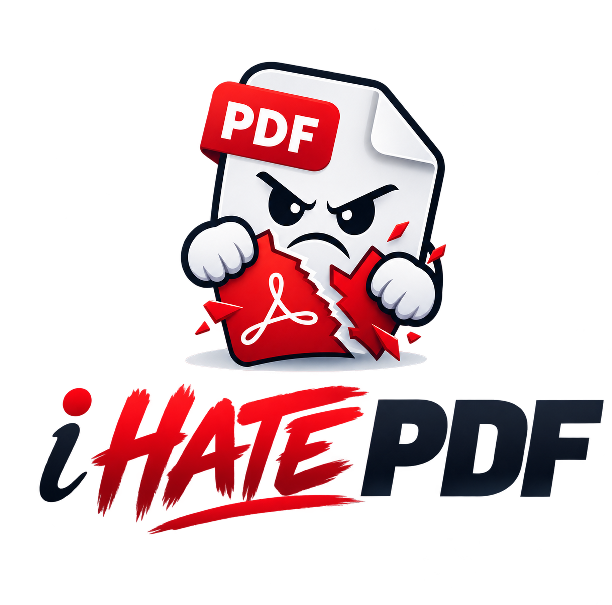
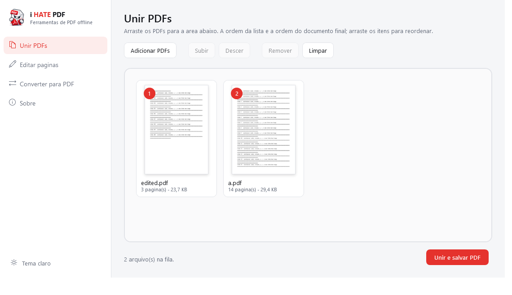
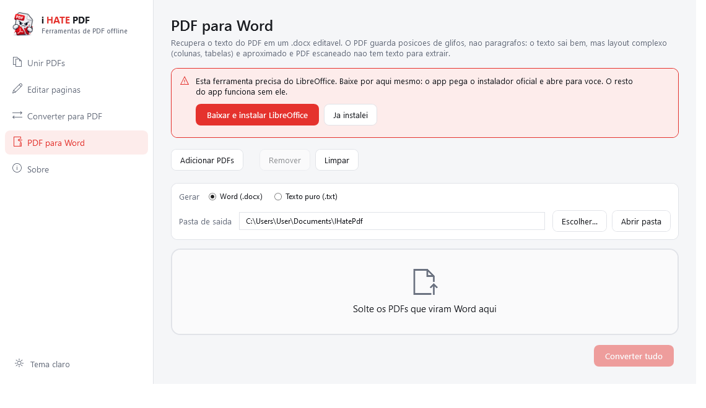
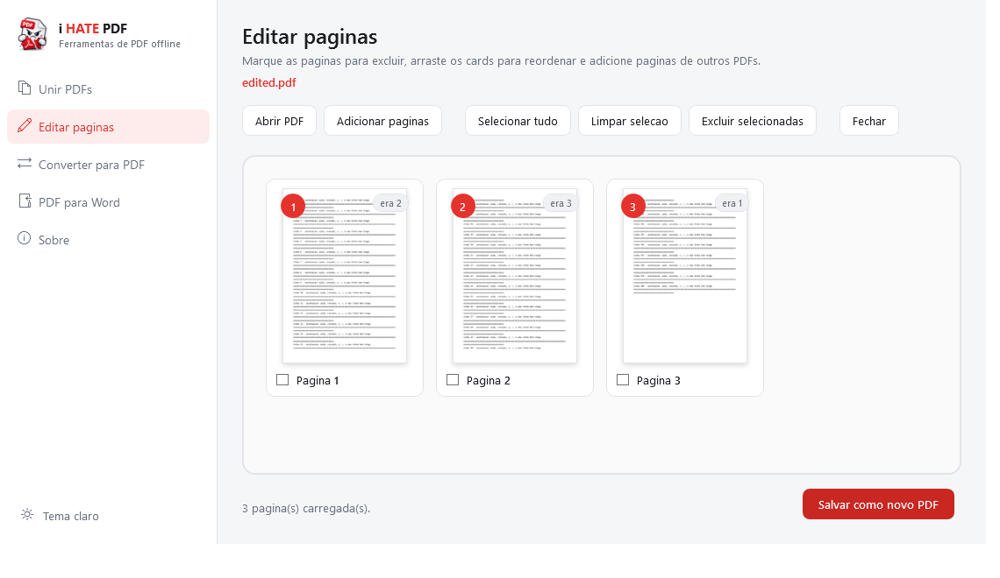
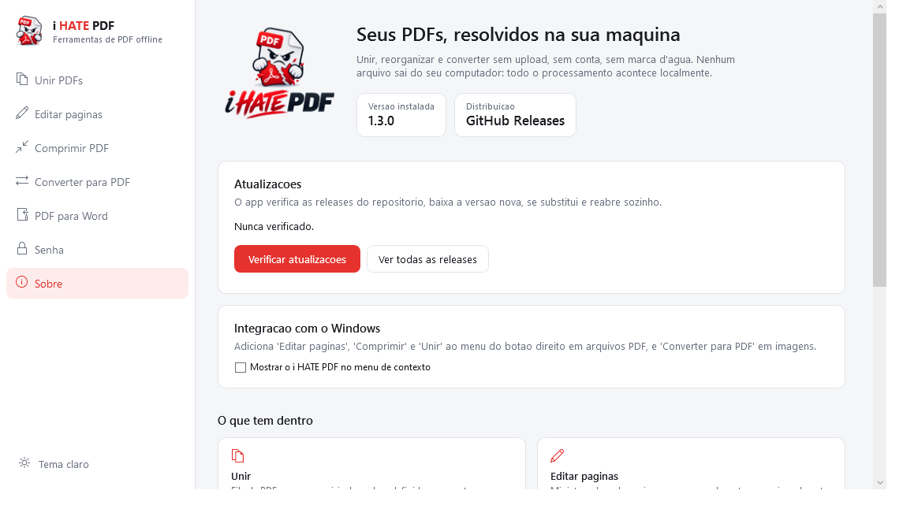
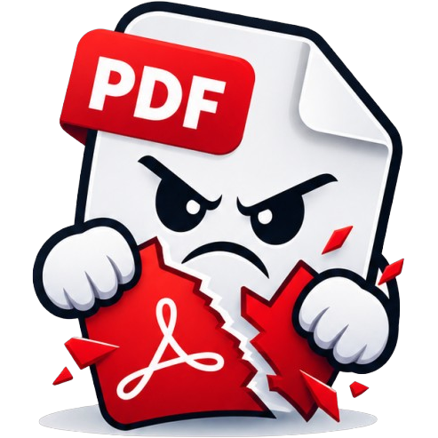

<div align="center">



### O PDF começou. Você termina.

Unir, reorganizar e converter PDFs no Windows — **sem upload, sem conta, sem marca d'água**.<br/>
Nenhum arquivo sai da sua máquina.

<br/>

[](https://github.com/XandeBritez/i-hate-pdf/releases/latest)
&nbsp;


</div>

---

## Por que existe

Todo site de PDF grátis cobra o mesmo pedágio: subir seu contrato para o servidor de um desconhecido, esperar a fila, aceitar a marca d'água e torcer para que o arquivo seja apagado depois.

**i HATE PDF** não tem servidor. É um `.exe`, você arrasta, ele resolve.

<div align="center">

</div>

---

## O que ele faz

<table>
<tr>
<td width="33%" valign="top">

### 🧩 Unir
Arraste vários PDFs. Cada um vira um **card com a capa visível** e um número que é literalmente a posição dele no documento final. Arrastou o card, mudou a ordem.

</td>
<td width="33%" valign="top">

### ✂️ Editar páginas
Abra um PDF e veja **cada página como miniatura**. Marque as que morrem, arraste as que ficam, puxe páginas de outro arquivo. Cada card mostra a **posição nova** e a **original** (`era 3`), então dá para conferir a reorganização antes de salvar. Salva como um PDF novo — o original não é tocado.

</td>
<td width="33%" valign="top">

### 🔁 Converter
`TXT` vira PDF direto, com paginação e quebra de linha de verdade.<br/>
`DOCX` e `XLSX` passam pelo **LibreOffice headless**, em fila, com o erro de cada arquivo na mão.

</td>
</tr>
</table>

### 📤 E o caminho de volta: PDF → Word

Recupera o conteúdo de um PDF em um `.docx` editável (via Writer do LibreOffice) ou em `.txt` puro (extração nativa com PdfPig, **sem depender de nada instalado**).

> **Honestidade sobre o formato:** o PDF descreve *posições de glifos*, não parágrafos. O texto sai bem; layout complexo — colunas, tabelas, caixas — é reconstruído por aproximação. E um PDF **escaneado não tem texto algum**: viraria um documento vazio, porque este app não faz OCR.

<div align="center">

</div>

<div align="center">

</div>

---

## Instalar

1. Baixe o `.zip` da [última release](https://github.com/XandeBritez/i-hate-pdf/releases/latest).
2. Extraia onde quiser — é portátil, não tem instalador.
3. Rode `IHatePdf.exe`.

O pacote é **self-contained**: não precisa instalar o .NET.

> **DOCX, XLSX e PDF → Word (.docx)** precisam do [LibreOffice](https://www.libreoffice.org). O `.txt` não precisa. Você não precisa sair do app para isso: a tela **PDF para Word** tem um botão que descobre a versão estável atual, baixa o instalador oficial com barra de progresso e o abre para você. O app acha o `soffice.exe` sozinho depois (registro, Program Files e PATH). Sem ele, TXT e todas as ferramentas de PDF continuam funcionando normalmente.

### Atualizar

A tela **Sobre** verifica as releases deste repositório e, se houver versão nova, **atualiza sozinha**: baixa o pacote, se substitui e reabre já na versão nova. Nada de zip para você extrair na mão.

> Um `.exe` em execução não pode sobrescrever a si mesmo, então o app grava um script temporário que espera o processo encerrar, troca o arquivo e reabre. O executável atual vira `.old` antes da cópia e é restaurado se algo falhar no meio. Se o app estiver numa pasta sem permissão de escrita (Program Files, por exemplo), ele avisa e manda você para a página da release em vez de tentar e falhar.

<div align="center">

</div>

---

## Compilar do código

```bash
git clone https://github.com/XandeBritez/i-hate-pdf.git
cd i-hate-pdf
dotnet run
```

Requer o **.NET 8 SDK**. O `csproj` usa `RollForward=LatestMajor`, então runtimes mais novos também servem.

Publicar como os releases fazem:

```bash
dotnet publish -c Release -r win-x64 --self-contained true -p:PublishSingleFile=true -o publish
```

---

## Como foi construído

MVVM estrito com `CommunityToolkit.Mvvm` — nenhuma View tem lógica no code-behind, nem o drag & drop.

```
Models/         PageReference, PdfFileItem, PageItem, ConversionItem
Services/       PdfService · ConversionService (+converters) · PdfExportService
                LibreOfficeRunner · PdfRenderService · WindowsFontResolver
                GitHubUpdateService · DialogService
ViewModels/     Main · Merge · Editor · Converter · PdfToWord · About
Views/          MergeView · EditorView · ConverterView · PdfToWordView · AboutView
Behaviors/      FileDropBehavior (drop do Explorer → ICommand) · conversores
Themes/         Light · Dark · Styles
```

| Peça | Biblioteca | Papel |
|---|---|---|
| Estrutura do PDF | [PDFsharp 6](https://www.nuget.org/packages/PDFsharp) | unir, extrair, remover e reordenar páginas |
| Miniaturas | [PDFtoImage](https://www.nuget.org/packages/PDFtoImage) (PDFium) | renderiza cada página como bitmap |
| MVVM | [CommunityToolkit.Mvvm](https://www.nuget.org/packages/CommunityToolkit.Mvvm) | bindings, comandos, messenger |
| Arrastar cards | [gong-wpf-dragdrop](https://www.nuget.org/packages/gong-wpf-dragdrop) | reordenação dentro das listas |
| DOCX / XLSX | LibreOffice `--headless` | Office → PDF e PDF → Word (`writer_pdf_import`) |
| Extração de texto | [PdfPig](https://www.nuget.org/packages/PdfPig) | PDF → TXT sem dependência externa |

**A ideia central:** toda operação de página é a mesma primitiva.

```csharp
// deletar, reordenar, inserir e unir sao a mesma coisa:
// uma lista ordenada de (arquivo, indice de pagina) virando um documento.
await pdfService.BuildAsync(pages.Select(p => p.ToReference()), outputPath);
```

Detalhes que custam caro quando ficam de fora:

- As miniaturas são renderizadas **fora da thread de UI** e chegam com `Freeze()` — sem isso, `InvalidOperationException` no binding.
- O PDFium é serializado por um semáforo; ele não é reentrante.
- O PDFsharp 6 **não resolve fontes sozinho**: sem um `IFontResolver`, converter TXT lança `No appropriate font found`.
- O LibreOffice **não serve para gerar `.txt`** a partir de PDF: ao importar, ele põe o conteúdo em quadros de texto flutuantes, e o filtro de texto puro exporta só o corpo do documento — o arquivo saía **vazio**. Por isso o TXT é extraído com PdfPig.
- O LibreOffice roda com **perfil temporário próprio** (`-env:UserInstallation=`), senão execuções seguidas travam no lock do perfil. E o `soffice` retorna 0 mesmo em algumas falhas, então a saída é validada pela existência do PDF.

---

## Limites conhecidos

- Operações de página copiam o conteúdo: **anotações, campos de formulário e sumário (outlines) não são preservados**.
- PDFs protegidos por senha não abrem — não há UI de senha.
- **PDF → Word não faz OCR**: PDF escaneado (imagem pura) não tem texto para extrair.
- Windows apenas. WPF não é multiplataforma.

---

<div align="center">



**Feito por Alexandre Britez Borsuka** ([@XandeBritez](https://github.com/XandeBritez)) · [Reportar um problema](https://github.com/XandeBritez/i-hate-pdf/issues)

</div>
